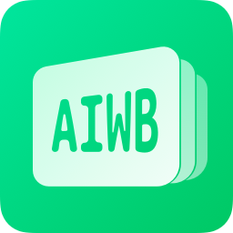

<picture>
    <source media="(prefers-color-scheme: dark)" srcset="./assets/awesome-iwb-icon-dark.png">
    
</picture>

<h1> {{= it.config.title }} </h1>

可能是 **最全的** 电教与希沃一体机软件推荐列表 
收集各类开源优质项目，让班级大屏更好用! 
**🌟 Awesome Iwb 助力每一位电教的成长 🌟**

> ⚠️ 注意：Awesome Iwb v2 还在早期测试中...

{{= module$badge_generateBadge({left:"最后更新",right:"2025年7月25日",color:"orange"}) }}
{{= module$badge_generateQQGroupBadge({number:"1004548404",link:"https://qm.qq.com/q/im8ZtJpkZy"}) }}

# 导引 & 目录 

<!-- {module:ranking.generateRankingToc} -->

## 所有项目目录

这里存放了所有 Awesome Iwb 索引的项目。请注意该 TOC 是自动生成的，不会过滤我们收集到的低质量项目。

<!-- {module:toc} -->

# 正文

{{= await renderModule$projects() }}
